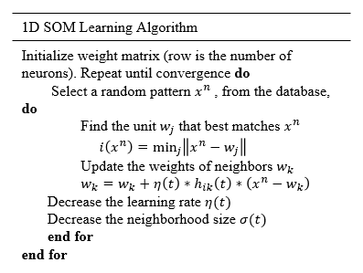
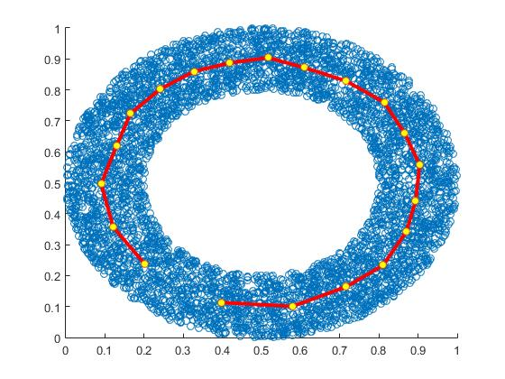
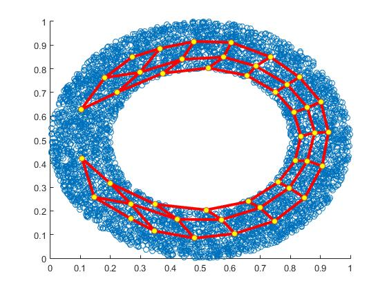
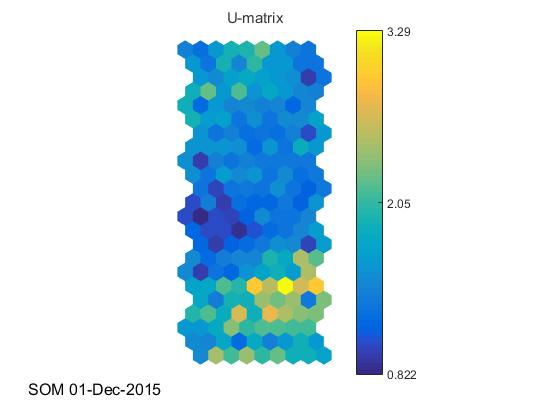
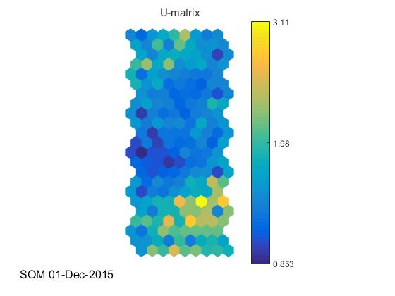

# Self Organizing Map (SOM) Implementation and Application
===========================
This project shows the Self Organizing Map (SOM) research, which mainly fucouses on its principle and algorithm. Meanwhile, this project presents implementation for SOM and experiments it into dataset called 'ring'. Finally, this project applies SOM algorithm into image clustering to test its practical performance. 

###　　　　　　　　　　　　Author:Liu Liu
###　　　　　　　　　 E-mail:liuliu9309212@gmail.com

===========================

------
# 1.  SOM Implementation

In this part, this project completes the unfinished one and two dimensional SOM implementation and make use of SOMs to visualize 2D and 3D data sets.

## 1.1  One Dimensional SOM Implementation

In One dimensional SOM, according to the 1D SOM learning algorithm, this project completes the unfinished SOM implementation. 

η(t)=η_0 exp⁡(-t/τ_1 ), σ(t)=σ_0  exp⁡(-t/τ_2 ), h_ik (t)=exp⁡(-(d_ik^2)/(2σ^2 (t))), where d_ik is the lattice distance between neurons i and k. 

There are some key steps for implementing this learning algorithm:

(1)	At the start, an M-by-N matrix is needed to initialize the weight matrix, where M is the number of neurons.

(2)	Decrease learning rate and neighborhood size with increasing t.

(3)	h_ik (t) is the element to determine neighbors of winner.

## 1.2  Two Dimensional SOM Implementation 

The learning algorithm of two dimensionality is similarly with that of one dimensionality. The differences compared with one dimensional learning algorithm are:

(1)	Building grid of neurons to state where each neuron is located in 2D SOM gird.

(2)	Lattice distance is calculated in 2D grid rather in 1D line.

## 1.3 SOM Implementation Results

*Figure 1*. 1D SOM Implementation.

*Figure 2*. 2D SOM Implementation

The inter-connected SOM units are represented by yellow points and red lines. As it can be seen, visualization can show the shape of the ring data no matter using 1D chain or 2D mesh approximately. So parameters selection is important. In this project, start learning rate is 0.1 and start radius is 10 because neighbors should involve all the neurons at the beginning. Furthermore, iteration should be at least 500 times the number of neurons in the network due to convergence rule.

# 2.  Image Clustering

## 2.1  U-Matrix

U-matrix is a unified distance matrix, which is constructed to facilitate the visualization. There are some characteristics in U-matrix:

(1)	Distance between the neighboring neurons gives an approximation of the distance between different parts of the underlying data.

(2)	Depicted in an image (heat map), similar colors depict the closely spaced nodes and distinct colors indicate the more distant nodes.

(3)	Groups of similar colors can be considered as a clusters, and the contrast parts as the boundary regions.

## 2.2 Image Clustering Results

*Figure 3*. U-matrix after training SOM

It can be found that images is classified for different sets after training SOM and the similar colors shows that group of images can be considered as a cluster with boundary regions. Parameters: initial radius 10, iterations 5000, initial learning rate 0.1

#　3.  Improved Feature Extraction

In this section, this project improves feature extraction function with adding RGB histogram and area for training images and clustering images.

*Figure 4*. U-matrix with Improved Feature Extraction

From U-matrix and the final result, SOM with RGB feature extraction performs much better than SOM without it.

# References

Chesnut, C. (2004). Self Organizing Map AI for Pictures. 
Kohonen, T. (2014). MATLAB Implementations and Applications of the Self-Organizing Map. 

